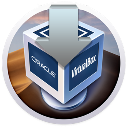
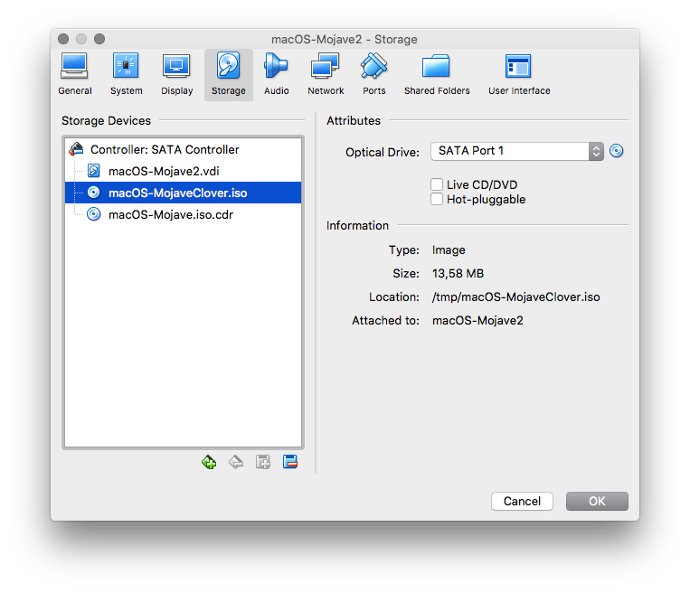
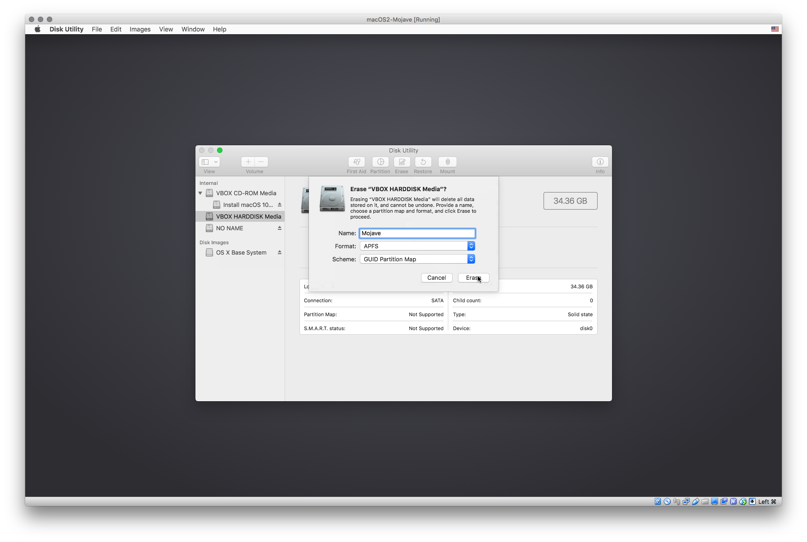
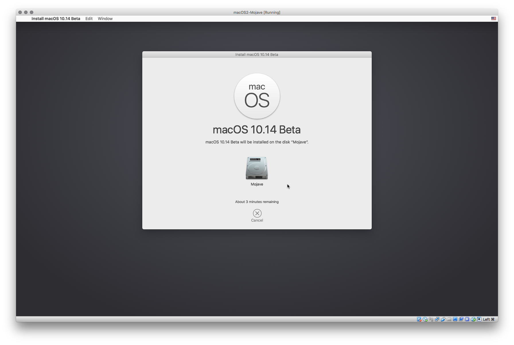
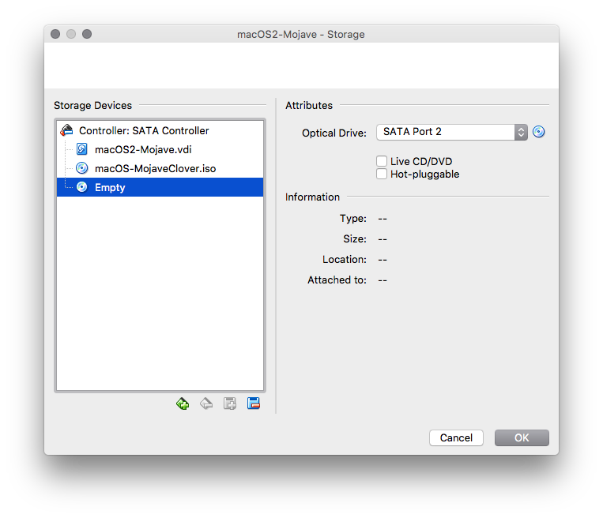
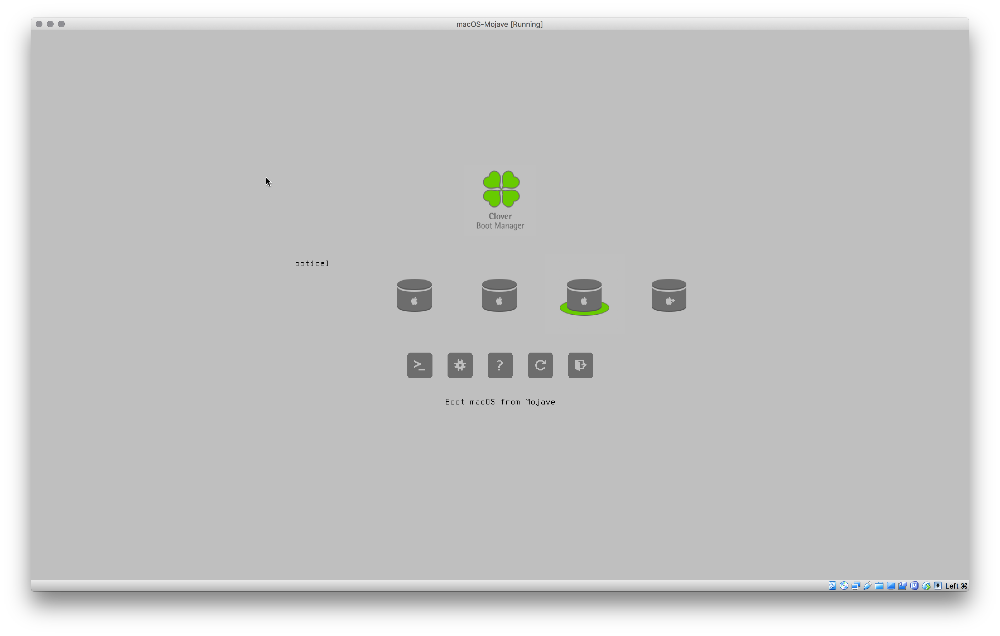
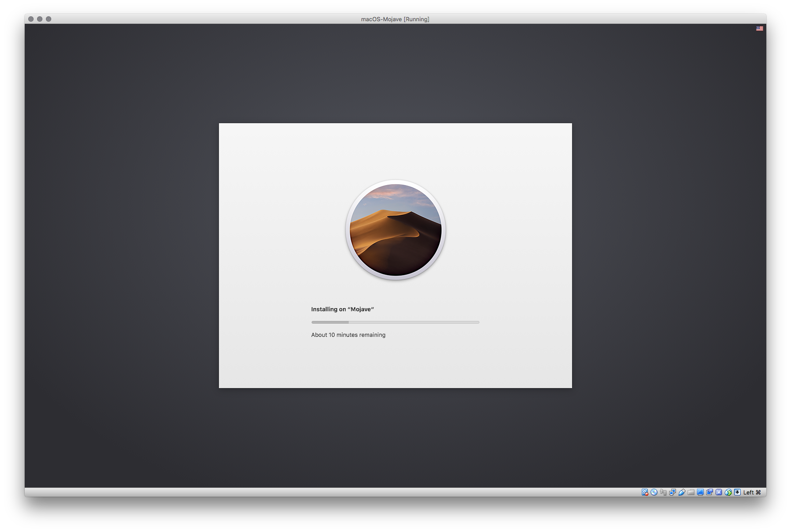
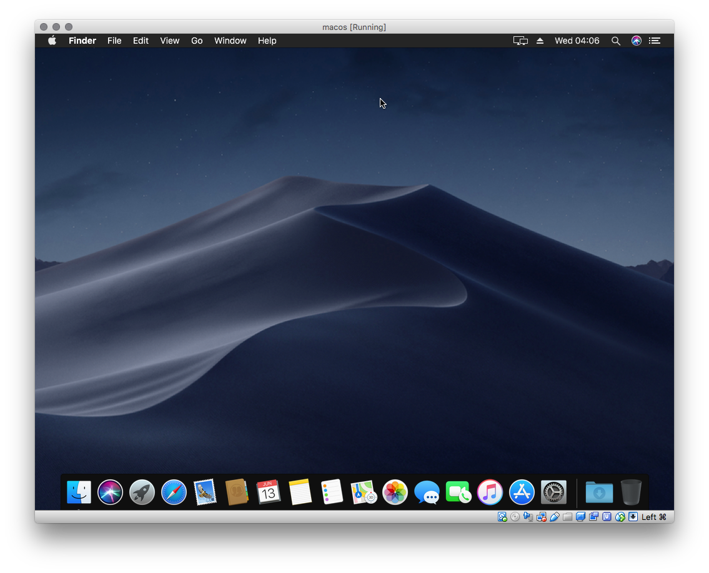

# Run macOS 10.14 Mojave (and other versions) in VirtualBox on macOS

## Overview

Simple script to automatically download, install and run macOS 10.14 Mojave (and other versions) in VirtualBox on macOS. Since VirtualBox 5.2 does not support booting from APFS volumes, this script is using the [Clover EFI bootloader](https://sourceforge.net/projects/cloverefiboot/) as a workaround.

[](https://app.codacy.com/app/AlexanderWillner/runMacOSinVirtualBox?utm_source=github.com&utm_medium=referral&utm_content=AlexanderWillner/runMacOSinVirtualBox&utm_campaign=Badge_Grade_Dashboard)

## ToC

 * [Quick Guide](#quick-guide)
 * [Step by Step Guide](#step-by-step-guide)
 * [Shell Hacker](#shell-hacker)
 * [FAQ](#faq)

##  Quick Guide

[](https://github.com/AlexanderWillner/runMacOSinVirtualBox/releases/download/1.2/RunMojaveVirtualbox.app.zip)

Download the app [```RunMojaveVirtualbox.app```](https://github.com/AlexanderWillner/runMacOSinVirtualBox/releases/download/1.2/RunMojaveVirtualbox.app.zip) and move it to the Applications folder. Then execute it (via Cight Click > Open).
 
## Step by Step Guide

1. Download macOS ([stable](https://itunes.apple.com/us/app/macos-mojave/id1398502828?mt=12) / [beta](https://beta.apple.com/sp/betaprogram/redemption#macos)) first. Note that you need to use a Mac to do so.
2. Around 2 minutes after executing this script/app you should have a configured and running VM:

3. After booting erase the virtual drive ```VBOX HARDDISK Media``` in Disk Utility using APFS and name it 'Mojave':

4. Install macOS on the erased virtual drive 'Mojave' (around 4 minutes):

5. After the reboot switch off the VM and remove ```macOS-Mojave.iso.cdr``` and restart:

6. Start macOS in the Clover boot menu (the initial installation might take some time):


7. Enjoy macOS in Virtualbox:

8. (optional) Remove the need to mount the Clover ISO file ( thanks to Issue #13 ) by running this command in a Terminal window within the virtual machine and remove the ISO from the setup afterwards:
```sudo sh /Volumes/NO\ NAME/moveCloverToEFI.sh```

## Shell Hacker

Execute ```make all``` to setup and run everything:

```
$ time make all
Running checks (around 1 second)....
Creating image '/tmp/macOS-Mojave.dmg' (around 20 seconds, will need sudo)....
Password:
Creating iso '/tmp/macOS-Mojave.iso.cdr' (around 25 seconds)....
Creating clover image '/tmp/macOS-MojaveClover.iso' (around 30 seconds)....
 - Extracting APFS EFI driver (around 3 seconds)....
 - Downloading Clover (needs Internet access)...
Creating VM HDD '/Users/awi/VirtualBox VMs/macOS-Mojave/macOS-Mojave.vdi' (around 5 seconds)....
Creating VM 'macOS-Mojave' (around 2 seconds)....
Starting VM 'macOS-Mojave' (around 3 minutes in the VM)....

real	1m21.689s
user	0m19.641s
sys	0m14.779s
```

### Customizing your build

Additionally the following parameters can be customized with environment variables:

| variable name | description                                         | default value                |
|---------------|-----------------------------------------------------|------------------------------|
| VM_NAME       | name of the virtual machine                         |  macOS-Mojave                |
| VM_DIR        | directory, where the virtual machine will be stored | HOME/VirtualBox VMs/$VM_NAME |
| VM_SIZE       | the size of the hard disk                           | 32768                        |
| VM_RES        | monitor resolution                                  | 1680x1050                    |
| VM_RAM        | ram size in megabytes                               | 4096                         |
| VM_VRAM       | video ram size in megabytes                         | 128                          |
| VM_CPU        | number of cpu cores to allocate                     | 2                            |


Execute ```make``` to get some help:

```
$ make
Some available commands:
 * all      : run everything needed (check, installer, clover, vm, run)
 * check    : check environment
 * installer: create macOS installer image
 * clover   : create clover boot image
 * vm       : create VM and disk
 * run      : run VM
 * clean    : delete generated images and downloaded files
 * stash    : delete generated VM and disk
 * test     : test shell scripts
 * style    : style shell scripts
 * harden   : harden shell scripts
 * feedback : create a GitHub issue
```

## FAQ

* Error Message
  * Q: I get the error code 2, 3, 4, or 6.
  * A: You need to have some software components installed on your machine (VirtualBox, VirtualBox Extension Pack, xz, awk). If you've installed http://brew.sh, the script will install these automatically. Otherwise, you need to install them manually.
* Reboot
  * Q: I see the message ```MACH Reboot```. What should I do?
  * A: The VM failed to restart. Restart manually.
* Installation Loop
  * Q: After starting the installation the VM restarts and I see the installer again.
  * A: You forgot to remove the installation CD. Switch off the VM and go to step 4.
* Kernel Panic
  * Q: I see the message ```Error loading kernel cache (0x9)```. What should I do?
  * A: This error is shown from time to time. Restart the VM.
* Black Screen
  * Q: When I then boot I don't get the Clover boot menu, just a black screen. What should I do?
  * A: Change the VM version in the settings from ```Mac OS X (64-bit)``` to ```macOS 10.13 High Sierra (64-bit)```
* Other Issue
  * Q: Something is not working. What should I do?
  * A: [Create a ticket](https://github.com/AlexanderWillner/runMacOSinVirtualBox/issues/new?template=bug_report.md)
